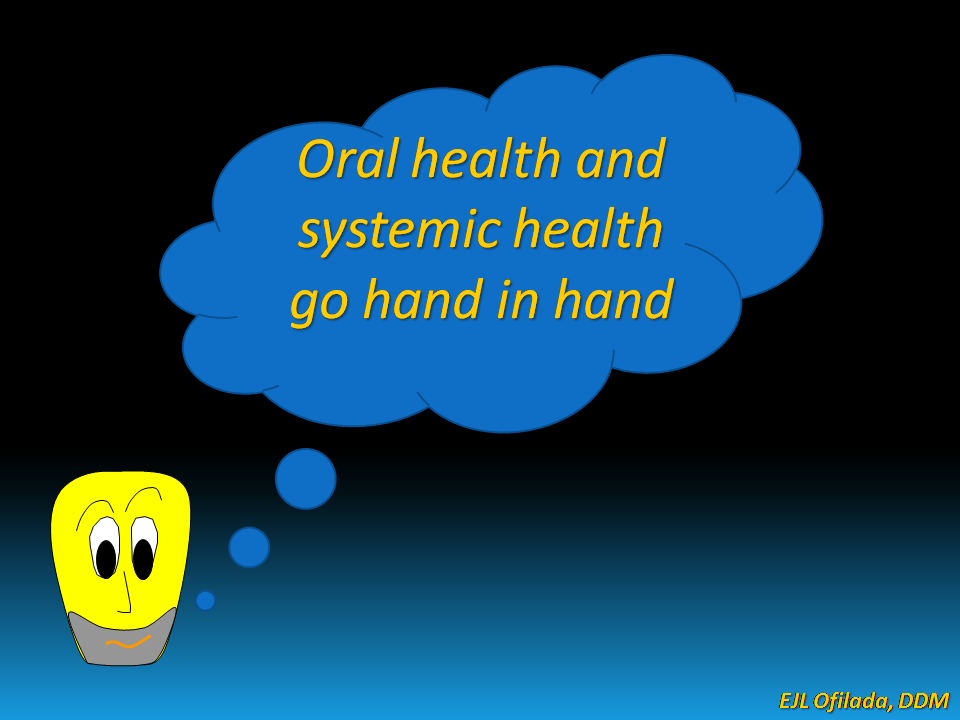

POHJD
================
DocOfi
April 15, 2016

This repository contains the data from Project Oral Health for Juvenile
Diabetics or POHJD. POHJD was an effort to provide for the dental needs
of children with type 1 diabetes. Despite the offer of free dental
treatment, patient participation was low. Only later on did it gain some
momentum when it grew to provide insulin, blood glucose meters, and
glucose monitoring strips. This got the parents of the children
interested but what made the children receive dental care with
enthusiasm was the promise of a free toy, clothes, or shoes at the end
of the treatment session. Unfortuantely, the free medicine, goodies for
the children and funding for the project was exhausted by 2015

I hope to transform the data we gathered into a publicly available
dataset which can be used for practice in learning R programming.

The data is not very large and has been analyzed for publication
previously. This was before I learned R and after commiting so many
mistakes along the way to learning research methodologies and
statistical analysis.

[Decayed Missing and Filled
Teeth](https://htmlpreview.github.io/?https://github.com/DocOfi/ProjectOralHealthforJuvenileDiabetics/blob/gh-pages/mychart1.html)

[DMFT](https://htmlpreview.github.io/?https://github.com/DocOfi/ProjectOralHealthforJuvenileDiabetics/blob/gh-pages/mychart2.html)

I started this project in 2016 but had to lay it down to rest for awhile
as i learned more about R programming. I plan to continue this project
in 2018 as a practice in learning how to use gitHub and collaborate with
other people in Git. The data has been sanitized previously to remove
any association with the persons who participated in the study. Written
consent forms were signed by the participants which allow the use of the
data for purposes of research without revealing the identity of the
participants. Interested volunteers are welcome to fork the repository
and offer suggestion by a pull request.

Please take into consideration that this is my first foray into a
collaborative project in GitHub and I am still in the process of
learning R. I just got over my fear of writing functions and got a taste
of writing packages after finishing Advanced R Programming and Building
R Packages in Coursera. For all purposes, I still consider myself a
newbie in R.

### Presentations and publication associated with the data

[Oral Health and Diabetes](http://www.rpubs.com/DocOfi/169246)

[Oral Health of Children and Youth with Type 1
Diabetes](https://docofi.shinyapps.io/ShinyApp15/)

[Oral Care for
Diabetics](https://www.slideshare.net/pinoydental/dental-comics-by-dr-ed-ofilada)

[Caries Experience of insulin- Dependent Diabetic Patients in the
Philippines](https://www.researchgate.net/publication/236905741_Caries_Experience_of_insulin-_Dependent_Diabetic_Patients_in_the_Philippines)

[Periodontal Health of Type 1 Diabetic Patients in the
Philippines](https://www.researchgate.net/publication/255181088_Periodontal_Health_of_Type_1_Diabetic_Patients_in_the_Philippines)

[A Survey on the Barriers to Dental Care Among Individuals with Type 1
Diabetes](https://www.researchgate.net/publication/260452819_A_Survey_on_the_Barriers_to_Dental_Care_Among_Individuals_with_Type_1_Diabetes)

[Improvement in Periodontitis Following Conservative Periodontal
Treatment in a Type 1 Diabetic
Patient](http://asean-endocrinejournal.org/index.php/JAFES/article/view/206/624)

[Oral Health Status of Children Attending a Summer Camp for Diabetes
Children](http://asean-endocrinejournal.org/index.php/JAFES/article/view/231/657)

[Managing Periodontitis in Type 1 Diabetic Patients Improves Glycemic
Control: A Case
Report](http://asean-endocrinejournal.org/index.php/JAFES/article/view/321/763)

[Oral Health Status of Children Attending a Summer Camp for Diabetes
Children](http://asean-endocrinejournal.org/index.php/JAFES/article/view/231/657)

[Project Oral Health for Juvenile
Diabetics](http://www.projectoralhealth.org/)
